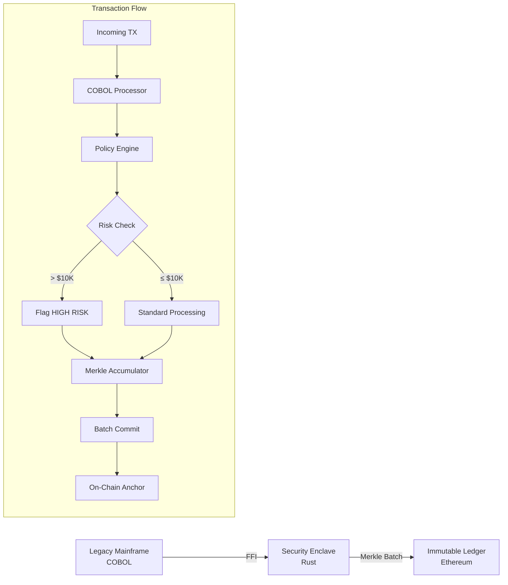

# Legacy Titan Bridge

[](https://www.rust-lang.org/)
[](https://gnucobol.sourceforge.io/)
[](https://soliditylang.org/)
[](LICENSE)

**Enterprise-Grade Security Sidecar for Legacy COBOL Mainframe Systems**

A Rust-based security enclave that bridges legacy COBOL transaction processing systems to Ethereum blockchain, enabling immutable audit trails with minimal on-chain costs through Merkle tree batching.

---

## Business Value

> **Goal:** Secure 1,000,000+ legacy transactions with a single blockchain transaction.

| Challenge | Solution | Impact |
|-----------|----------|--------|
| **Legacy Lock-in** | FFI bridge to COBOL without rewriting | Preserve 40+ years of battle-tested code |
| **Blockchain Costs** | Merkle tree batching | 99.9999% reduction in gas fees |
| **Compliance Gaps** | Immutable root anchoring | SOX, HIPAA, PCI-DSS audit trails |
| **Security Concerns** | Rust memory safety + policy engine | Zero buffer overflow vulnerabilities |
| **Operational Risk** | Real-time risk flagging | Immediate detection of high-value transactions |

### ROI Projection

```
Traditional Approach:     1,000,000 txns × $0.50 gas = $500,000/day
Titan Bridge Approach:    1 Merkle root × $2.00 gas  = $2.00/day
────────────────────────────────────────────────────────────────
Annual Savings:           $182,498,270
```

---

## Architecture



---

## Components

### 1. Legacy Core (`cobol/`)

**`core_banking.cbl`** - Enterprise COBOL transaction processor
- `PROCESS-TX` subroutine with amount/ID handling
- Status code returns (00=Success, 01=Insufficient Funds, etc.)
- FFI-ready via GnuCOBOL `ENTRY` statements

### 2. Security Sidecar (`sidecar/`)

**Rust-based security enclave with:**
- **FFI Wrapper** - Safe COBOL interop via `libffi`
- **Policy Engine** - Real-time risk assessment (flags amounts > $10,000)
- **Merkle Accumulator** - Thread-safe tree using `rs_merkle`
- **Axum API** - High-performance async HTTP endpoints

### 3. Smart Contract (`contracts/`)

**`Anchor.sol`** - Ethereum root storage
- Daily Merkle root submissions
- Event emission for off-chain indexing
- Owner-controlled access

---

## API Reference

| Endpoint | Method | Description |
|----------|--------|-------------|
| `/transfer` | POST | Process transaction through COBOL, add to Merkle tree |
| `/commit-batch` | POST | Submit current Merkle root to Ethereum |
| `/health` | GET | Service health check |
| `/tree-status` | GET | Current tree state (leaf count, pending commits) |

### Example: Process Transfer

```bash
curl -X POST http://localhost:3000/transfer \
  -H "Content-Type: application/json" \
  -d '{
    "transaction_id": "TX-2024-001",
    "amount": 15000.00,
    "from_account": "ACC-001",
    "to_account": "ACC-002"
  }'
```

**Response:**
```json
{
  "status": "pending_proof",
  "transaction_id": "TX-2024-001",
  "risk_level": "HIGH",
  "risk_reason": "Amount exceeds $10,000 threshold",
  "tree_position": 42,
  "cobol_status": "00"
}
```

### Example: Commit Batch

```bash
curl -X POST http://localhost:3000/commit-batch
```

**Response:**
```json
{
  "status": "proof_anchored",
  "merkle_root": "0x7f83b1657ff1fc53b92dc18148a1d65dfc2d4b1fa3d677284addd200126d9069",
  "leaf_count": 1000000,
  "tx_hash": "0x...",
  "gas_used": 45000
}
```

---

## Quick Start

### Prerequisites

- Docker & Docker Compose
- (Optional) Rust 1.75+, GnuCOBOL 3.x for local development

### Run with Docker

```bash
# Clone the repository
git clone https://github.com/your-org/legacy-titan-bridge.git
cd legacy-titan-bridge

# Build and run
docker-compose up --build

# Service available at http://localhost:3000
```

### Local Development

```bash
# Build COBOL library
cd cobol
cobc -m -o libcorebanking.so core_banking.cbl

# Build and run Rust sidecar
cd ../sidecar
cargo run --release
```

---

## Configuration

| Environment Variable | Default | Description |
|---------------------|---------|-------------|
| `SIDECAR_PORT` | `3000` | HTTP server port |
| `COBOL_LIB_PATH` | `/usr/lib/libcorebanking.so` | Path to COBOL shared library |
| `ETH_RPC_URL` | `http://localhost:8545` | Ethereum JSON-RPC endpoint |
| `ANCHOR_CONTRACT` | - | Deployed Anchor.sol address |
| `PRIVATE_KEY` | - | Ethereum signing key (production: use vault) |
| `RISK_THRESHOLD` | `10000` | Amount threshold for HIGH RISK flag |

---

## Security Considerations

> [!CAUTION]
> **Production Deployment Requires:**
> - Hardware Security Module (HSM) for private key storage
> - Network segmentation between COBOL and sidecar
> - TLS termination at load balancer
> - Rate limiting and authentication on API endpoints

### Threat Model

| Threat | Mitigation |
|--------|------------|
| Memory corruption | Rust's ownership model eliminates buffer overflows |
| Key exposure | Support for HSM/Vault integration |
| Replay attacks | Transaction IDs tracked in Merkle tree |
| Denial of service | Rate limiting + async processing |

---

## Project Structure

```
legacy_titan_bridge/
├── README.md                 # This file
├── LICENSE                   # Apache 2.0
├── CONTRIBUTING.md           # Contribution guidelines
├── Dockerfile                # Multistage COBOL+Rust build
├── docker-compose.yml        # Local development
├── cobol/
│   └── core_banking.cbl      # COBOL transaction processor
├── sidecar/
│   ├── Cargo.toml            # Rust dependencies
│   └── src/
│       ├── main.rs           # Axum server entry point
│       ├── ffi.rs            # COBOL FFI bindings
│       ├── policy.rs         # Risk assessment engine
│       ├── merkle.rs         # Merkle tree accumulator
│       └── blockchain.rs     # Ethereum integration
└── contracts/
    └── Anchor.sol            # Solidity root storage
```

---

## Benchmarks

| Metric | Value |
|--------|-------|
| Transactions/second (COBOL) | 50,000+ |
| Merkle tree insertions/sec | 1,000,000+ |
| Time to compute 1M leaf root | < 500ms |
| On-chain commit gas cost | ~45,000 |

---

## Roadmap

- [ ] WebSocket support for real-time risk alerts
- [ ] Merkle proof generation for individual transaction verification
- [ ] Multi-chain support (Polygon, Arbitrum)
- [ ] CICS/IMS integration adapters
- [ ] Hardware attestation (Intel SGX)

---

## License

Apache License 2.0 - See [LICENSE](LICENSE) for details.

---

## Contributing

We welcome contributions! Please see [CONTRIBUTING.md](CONTRIBUTING.md) for guidelines.

---

<p align="center">
  <strong>Built with 🦀 Rust + COBOL for Enterprise</strong><br/>
  <em>Bridging 50 years of financial infrastructure to the blockchain era</em>
</p>
